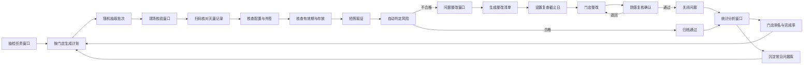

## 1. 产品概述

口腔机构感控督导稽核系统（简称"感控稽核台"）是一款面向连锁口腔品牌巡检人员、院感负责人与区域管理者的桌面端质控工具。系统聚焦消毒追溯链路中的"抽查—复核—整改"闭环，将传统追溯系统从"有人填表"升级为"有人持续审"，通过随机抽样、扫码核验、风险自动判定与整改追踪，确保灭菌包配置、签名、有效期与存放位置的合规性可被持续监督。

- 目标用户：连锁口腔品牌督导员、院感负责人、区域管理者
- 核心价值：以稽核驱动整改，以数据沉淀问题库，输出门店排名与完成率，形成可量化的感控质量闭环

## 2. 核心功能

### 2.1 用户角色

| 角色 | 说明 | 核心权限 |
|------|------|----------|
| 督导员 | 现场执行抽查与核验 | 创建抽检计划、现场核验、拍照取证、提交问题 |
| 院感负责人 | 复核问题与整改 | 复核整改结果、设置复查截止日、关闭问题 |
| 区域管理者 | 全局统计与排名 | 查看门店排名、完成率、问题库、导出报表 |

### 2.2 功能模块（4 大窗口）

1. **抽检任务窗口**：抽查计划管理、按门店生成计划、随机抽取器械包批次、抽样规则配置、任务看板
2. **现场核验窗口**：扫码核对灭菌记录、包内配置与外签一致性核查、有效期与存放位置核查、照片证据、风险自动判定
3. **问题整改窗口**：整改清单、风险分级、复查截止日、整改追踪时间线、完成率追踪、复核确认
4. **统计分析窗口**：门店排名、整改完成率、风险分布、常见问题库、趋势分析

### 2.3 页面详情

| 页面名称 | 模块名称 | 功能描述 |
|-----------|-------------|---------------------|
| 抽检任务 | 抽样规则配置 | 按门店、器械包类型、批次范围设置抽样比例与随机种子 |
| 抽检任务 | 计划生成器 | 选择门店后一键生成抽查计划，自动分配抽样数量 |
| 抽检任务 | 随机批次抽取 | 基于规则从门店批次库中随机抽取待检器械包 |
| 抽检任务 | 任务看板 | 按状态（待开始/进行中/待复核/已完成）展示任务卡片 |
| 抽检任务 | 任务详情 | 展示任务范围、抽样清单、负责人、截止时间 |
| 现场核验 | 扫码核验台 | 输入/扫码器械包批次，调取灭菌记录并自动比对 |
| 现场核验 | 灭菌记录核对 | 展示灭菌锅次、温度、压力、时长、操作人、灭菌日期 |
| 现场核验 | 包内配置核查 | 逐项核对包内器械清单与配置标准一致性 |
| 现场核验 | 外签一致性 | 核对包外标识（锅次、灭菌日期、失效日期、操作人签名）是否齐全 |
| 现场核验 | 有效期与存放 | 校验失效日期是否合规、存放位置是否分区合理 |
| 现场核验 | 照片证据 | 对配置、签名、存放位置拍照并关联核验项 |
| 现场核验 | 风险自动判定 | 缺签名/漏步骤/超期/错位自动判定高/中/低风险 |
| 问题整改 | 整改清单 | 按门店、风险级别、状态筛选整改任务 |
| 问题整改 | 整改详情 | 问题描述、证据照片、责任人、整改要求 |
| 问题整改 | 复查截止日 | 为每条问题设置复查截止日，临近超期高亮提醒 |
| 问题整改 | 追踪时间线 | 展示发现→整改→复核→关闭全流程节点 |
| 问题整改 | 复核确认 | 院感负责人复核整改证据并关闭或退回 |
| 统计分析 | 门店排名 | 按合规率/整改完成率对门店排名，支持升降序 |
| 统计分析 | 完成率统计 | 整体与分门店整改完成率、超期率 |
| 统计分析 | 风险分布 | 高/中/低风险问题占比与类型分布 |
| 统计分析 | 常见问题库 | 按频次沉淀常见问题及建议整改动作 |
| 统计分析 | 趋势分析 | 按月度展示问题数与整改完成率趋势 |

## 3. 核心流程

**主流程**：督导员在"抽检任务"窗口选择门店并按规则生成抽查计划，系统随机抽取器械包批次；督导员进入"现场核验"窗口扫码调取灭菌记录，逐项核查配置、签名、有效期与存放位置并拍照取证，系统根据缺失项自动判定风险级别；不合格项自动流入"问题整改"窗口生成整改清单并设置复查截止日，门店整改后由院感负责人复核确认；所有数据沉淀至"统计分析"窗口，输出门店排名、完成率与常见问题库，驱动下一轮抽查计划。

## 4. 用户界面设计

### 4.1 设计风格

- **主色调**：深医疗青 `#0D5C63`（专业、可信、感控），辅以暖橙 `#C2410C` 作为强调与区分
- **状态色**：通过 `#15803D`、警告 `#B45309`、高风险 `#B91C1C`、待处理 `#475569`
- **按钮风格**：低圆角（4px）、细描边、克制阴影，强调"仪表盘"质感而非糖果化
- **字体**：标题用 Sora（几何感、专业），正文用 Manrope（清晰易读），数据/批次号/编码用 JetBrains Mono（等宽精准）
- **布局风格**：左侧固定导航栏 + 顶部上下文栏 + 主内容区 + 底部状态栏的桌面端四区结构
- **图标风格**：线性细描边图标（Lucide），与文字等高对齐，禁用 emoji
- **背景纹理**：极浅点阵网格 + 微噪点，营造"无菌操作台"的精密感

### 4.2 页面设计概览

| 页面名称 | 模块名称 | UI 元素 |
|-----------|-------------|-------------|
| 全局框架 | 左侧导航栏 | 深色品牌区 + 4 窗口导航 + 底部用户区，青色高亮当前窗口 |
| 全局框架 | 顶部上下文栏 | 当前窗口标题、门店切换器、搜索、通知、用户头像 |
| 全局框架 | 底部状态栏 | 同步状态、当前门店、稽核员、系统时间 |
| 抽检任务 | 计划生成器 | 门店选择卡片、抽样规则表单、批次预览表、生成按钮 |
| 抽检任务 | 任务看板 | 四列状态看板，任务卡片含门店/数量/进度/截止日 |
| 现场核验 | 扫码核验台 | 大号扫码输入框、批次号 mono 字体、灭菌记录卡片 |
| 现场核验 | 核查清单 | 分组核查项 + 通过/不合格开关 + 拍照入口 + 风险标签 |
| 问题整改 | 整改清单 | 筛选条 + 整改表格 + 风险徽章 + 超期高亮 |
| 问题整改 | 追踪时间线 | 垂直时间线节点、证据缩略图、复核操作区 |
| 统计分析 | 门店排名榜 | 排名徽章、合规率进度条、升降箭头 |
| 统计分析 | 图表区 | 完成率环图、风险分布柱图、趋势折线图 |
| 统计分析 | 问题库 | 问题分类标签云、频次条形、建议动作 |

### 4.3 响应式

桌面端优先，最小支持 1280×800，主内容区在 1440px 以上展开多栏；不针对移动端优化（督导员现场使用平板/笔记本），关键操作区保证触控可达。

### 4.4 动效

- 窗口切换：内容区淡入 + 轻微上移
- 任务卡片/表格行：交错入场
- 风险标签：脉冲提示高风险项
- 扫码成功：批次号卡片高亮闪现
- 数字统计：滚动计数动画
