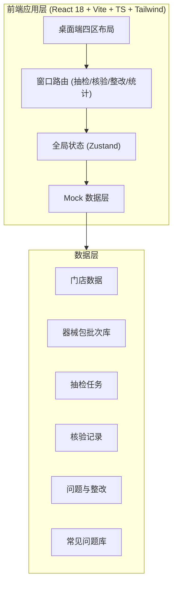
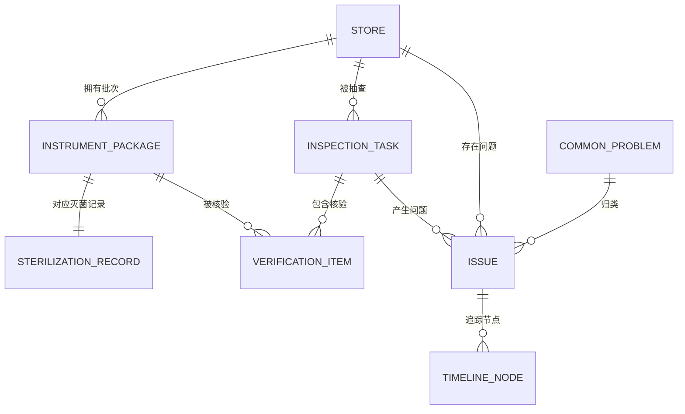

## 1. 架构设计



纯前端单页应用，所有数据使用内置 Mock 数据层模拟，状态由 Zustand 统一管理，不依赖后端服务。

## 2. 技术说明

- 前端：React@18 + TypeScript + tailwindcss@3 + vite
- 初始化工具：vite-init（react-ts 模板）
- 状态管理：Zustand（轻量、桌面端窗口状态切换）
- 图表：Recharts（环图/柱图/折线图）
- 图标：lucide-react（线性细描边）
- 字体：Sora（标题）+ Manrope（正文）+ JetBrains Mono（数据编码）通过 Google Fonts / Fontsource 引入
- 数据：内置 Mock 数据（门店、器械包、任务、核验、问题、问题库）
- 后端：无（演示用 Mock 数据，预留接口结构以便后续接入）

## 3. 路由定义

| 路由 | 窗口 | 说明 |
|-------|------|------|
| /tasks | 抽检任务 | 计划生成、抽样规则、任务看板 |
| /verify | 现场核验 | 扫码核验台、核查清单、风险判定 |
| /rectify | 问题整改 | 整改清单、追踪时间线、复核 |
| /stats | 统计分析 | 门店排名、图表、问题库 |

使用 React Router v6，默认重定向 `/` → `/tasks`。

## 4. API 定义（预留结构）

前端 Mock 层封装以下领域服务接口，便于后续替换为真实后端：

```typescript
// 门店
interface Store { id: string; name: string; code: string; region: string; manager: string; }

// 器械包批次
interface InstrumentPackage {
  id: string; batchNo: string; packageName: string; storeId: string;
  sterilizerId: string; cycleNo: string; sterilizedAt: string; expiresAt: string;
  storageLocation: string; status: 'pending' | 'verified' | 'issue';
}

// 灭菌记录
interface SterilizationRecord {
  packageId: string; cycleNo: string; temperature: number; pressure: number;
  duration: number; operator: string; verifiedAt: string;
}

// 抽检任务
interface InspectionTask {
  id: string; storeId: string; planName: string; type: string;
  status: 'todo' | 'doing' | 'review' | 'done';
  inspector: string; sampleSize: number; deadline: string; createdAt: string;
  packageIds: string[];
}

// 核验项
interface VerificationItem {
  id: string; taskId: string; packageId: string; category: 'config' | 'signature' | 'expiry' | 'storage';
  label: string; result: 'pass' | 'fail' | 'pending'; photoUrl?: string; notes?: string;
}

// 问题/整改
interface Issue {
  id: string; taskId: string; packageId: string; storeId: string;
  type: string; description: string; riskLevel: 'high' | 'medium' | 'low';
  status: 'open' | 'rectifying' | 'review' | 'closed';
  deadline: string; assignee: string; createdAt: string; resolvedAt?: string;
  timeline: { node: string; at: string; actor: string; note?: string }[];
}

// 常见问题
interface CommonProblem { id: string; category: string; description: string; frequency: number; suggestion: string; }
```

## 5. 服务端架构

无后端。Mock 服务以 `src/services/mock.ts` 形式提供数据与操作方法，模拟异步调用。

## 6. 数据模型

### 6.1 数据模型定义



### 6.2 数据定义（Mock 种子）

```typescript
// 种子门店：5 家连锁门店（华东/华南/华北区域）
// 种子器械包：每店 30+ 批次，覆盖拔牙包/种植包/修复包/洁治包等
// 种子灭菌记录：含合规与缺陷样本（缺签名/超期/错位）
// 种子任务：覆盖四种状态的看板任务
// 种子问题：含高/中/低风险与不同整改阶段
// 种子问题库：8 类常见问题及建议动作
```

种子数据集中维护在 `src/data/seed.ts`，提供真实感的批次号、灭菌参数、门店信息，便于演示闭环流转。
